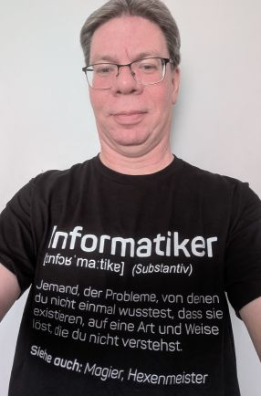

# General

- Born: 1970
- Sex/Gender: male / 😄 Pronouns: he/him
- Nationality: German
- Location: Germany/Bremen
- Languages spoken: German, English
- 📫 How to reach me: powerstat@web.de

# Special interests

- Calendrical calculations
- Homeautomation
- Internet of things (IoT)
- Virtual Reality
- Artifical Inteligence
- Raspberry Pi
- Arduino
- ESP32

# Profiles

- [Xing](https://www.xing.com/profile/Kai_Hofmann2/)
- [Stackoverflow](https://stackoverflow.com/users/3021395/powerstat?tab=profile)
- [WWW](https://www.powerstat.de/)
- [Mastodon @PowerStat@fosstodon.org](https://fosstodon.org/@PowerStat)

# Skills

- Programming languages: Basic, Assembler, Comal, Forth, Pascal, Logo, Modula II, Miranda, ASpecT, C, C++, Java, AspectJ, ...
- Frameworks: Spring
- Script languages: Tcl, JavaScript, PHP, Rexx, bash
- Markup languages: SGML, HTML 2.0, 3.2, 4.0, XHTML, XML, WML, CSS, Microformats
- Regular expressions: sed, awk, grep, Perl
- Databases "ANSI-SQL", MySQL, MariaDB, Sybase, PostgreSQL, SAP-DB/MaxDB, Oracle
- Servers: Apache http, Apache tomcat
- Version control systems: CVS, Subversion, git
- QA: Coding rules
- Security
- Usability
- Engineering

## 🌱 I’m currently learning ...

- Rust
- Kotlin

# Publications

- "Rauchzeichen V2.0; Website-Redesign mit Open-Source-Technik", iX 11/03 Seite 128ff, Heise Zeitschriften Verlag GmbH & Co. KG
- Report "E-Government without active content", Dr. Christian Böttger, Kai Hofmann, Philipp Kamps, et al., 11.08.2005, 53 pages + website

## C64 programs

Here are some of my programs I have written in the times of the good old C64's (1984-1990):

- A very powerful message-writer system
- A Turbo-Tape backup system for disks
- A Turbo-Tape based tape contents system
- A low-resolution window system with support for RAM-Expansions
- An address database based on my window system (with autodial function)
- An video database based on my window system
- Very fast Printerdriver for GEOS and MPS802 (with Graphic-ROM)
- Software for the Video-1000 video digitizer
- Software to decode the DCF77 signal for the Conrad-Electronic receiver

## Amiga programs

And here you find some programs I have written for the Amiga (all submitted via [Aminet](https://aminet.net/)):

- Kalender V2.3
- Port of SGMLS by James Clark
- ASpecT Port and debugging of the functional programming language ASpecT by Jörn von Holten
- Toolbox Port and optimization of the Karlsruher Compiler Construction Toolbox by Josef Grosch
- Installer tools
- PLog - an utility that can log modem connections using the PhoneLog file standard
- Magic User Interface custom classes
- Reusable basic library stuff for Magic User Interface custom classes
- Universal installer script for Magic User Interface custom classes
- Universal installer script for Amiga libraries
- CheckHTML based on the SGMLS port

## OpenSource contributions in the past

OpenSource Projects to whom I contributed something in the past:

- ROBODoc is a documentation tool. It extracts the documentation from your source code and formats it in HTML, RTF, TeX, XML DocBook (PDF), or ASCII. Works with C, C++, Perl, Scripts, Tcl, FORTRAN, and any other language that supports remarks.
- pb.WebMAUI - The Web-Mail Administration User Interface aims at building a web-based administration tool for managing: complex maildomains mail user accounts server based filtering incl. "out-of-office mail replies".
- jShopz is a Java based online shop system. It's Java coded strong architecture makes it first choice for projects where high cutomizability and performance are important. Database connection via JDBC.
- phpGroupWare
- Business groupware - Business groupware (bgroupware) is a spin-off of the well known phpgroupware. This has been done for architecural and other reasons to keep imporvements alive that have been done by some professional ex-developers from a known company.
- OpenOffice.org

## 🔭 I’m currently working on ...

- DateLib porting to cmake

# 💬 Ask me about ...

- Everything

# Readers' advisory

- [Code Is for Humans](https://codeisforhumans.com/); A Guide to Human-Centric Software Engineering; Zohar Jackson; 2023
